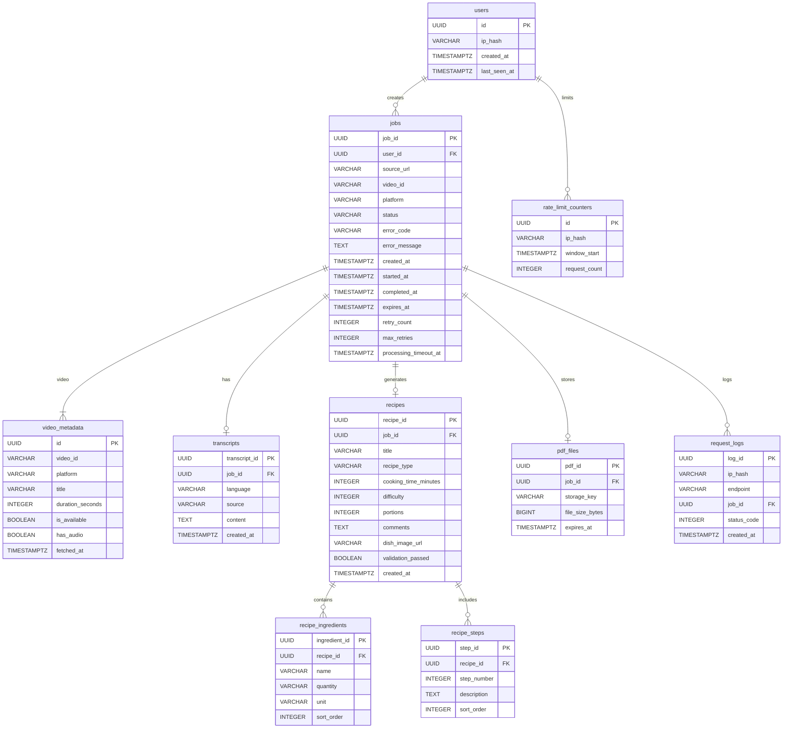

```mermaid
erDiagram
    %% ─────────────────────────────────────
    %% CORE TABLES
    %% ─────────────────────────────────────
    users {
        UUID id PK
        VARCHAR ip_hash
        TIMESTAMPTZ created_at
        TIMESTAMPTZ last_seen_at
    }
    
    jobs {
        UUID job_id PK
        UUID user_id FK
        VARCHAR source_url
        VARCHAR video_id
        VARCHAR platform
        VARCHAR status
        VARCHAR error_code
        TEXT error_message
        TIMESTAMPTZ created_at
        TIMESTAMPTZ started_at
        TIMESTAMPTZ completed_at
        TIMESTAMPTZ expires_at
        INTEGER retry_count
        INTEGER max_retries
        TIMESTAMPTZ processing_timeout_at
    }
    
    video_metadata {
        UUID id PK
        VARCHAR video_id
        VARCHAR platform
        VARCHAR title
        INTEGER duration_seconds
        BOOLEAN is_available
        BOOLEAN has_audio
        TIMESTAMPTZ fetched_at
    }
    
    %% ─────────────────────────────────────
    %% RECIPE DATA
    %% ─────────────────────────────────────
    transcripts {
        UUID transcript_id PK
        UUID job_id FK
        VARCHAR language
        VARCHAR source
        TEXT content
        TIMESTAMPTZ created_at
    }
    
    recipes {
        UUID recipe_id PK
        UUID job_id FK
        VARCHAR title
        VARCHAR recipe_type
        INTEGER cooking_time_minutes
        INTEGER difficulty
        INTEGER portions
        TEXT comments
        VARCHAR dish_image_url
        BOOLEAN validation_passed
        TIMESTAMPTZ created_at
    }
    
    recipe_ingredients {
        UUID ingredient_id PK
        UUID recipe_id FK
        VARCHAR name
        VARCHAR quantity
        VARCHAR unit
        INTEGER sort_order
    }
    
    recipe_steps {
        UUID step_id PK
        UUID recipe_id FK
        INTEGER step_number
        TEXT description
        INTEGER sort_order
    }
    
    %% ─────────────────────────────────────
    %% STORAGE & AUDIT
    %% ─────────────────────────────────────
    pdf_files {
        UUID pdf_id PK
        UUID job_id FK
        VARCHAR storage_key
        BIGINT file_size_bytes
        TIMESTAMPTZ expires_at
    }
    
    request_logs {
        UUID log_id PK
        VARCHAR ip_hash
        VARCHAR endpoint
        UUID job_id FK
        INTEGER status_code
        TIMESTAMPTZ created_at
    }
    
    rate_limit_counters {
        UUID id PK
        VARCHAR ip_hash
        TIMESTAMPTZ window_start
        INTEGER request_count
    }
    
    %% ─────────────────────────────────────
    %% RELATIONSHIPS
    %% ─────────────────────────────────────
    users ||--o{ jobs : "creates"
    jobs ||--o| transcripts : "has"
    jobs ||--o| recipes : "generates"
    jobs ||--o| pdf_files : "stores"
    recipes ||--o{ recipe_ingredients : "contains"
    recipes ||--o{ recipe_steps : "includes"
    jobs ||--o{ request_logs : "logs"
    jobs ||--|{ video_metadata : "video"
    users ||--o{ rate_limit_counters : "limits"
```