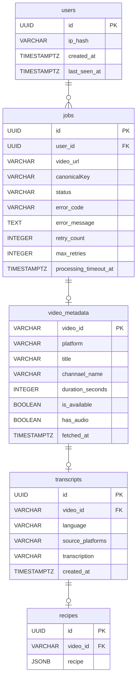

```mermaid
erDiagram
    %% ─────────────────────────────────────
    %% CORE TABLES
    %% ─────────────────────────────────────
    users {
        UUID id PK
        VARCHAR ip_hash
        TIMESTAMPTZ created_at
        TIMESTAMPTZ last_seen_at
    }
    
    jobs {
        UUID id PK
        UUID user_id FK
        VARCHAR video_url
        VARCHAR canonicalKey
        VARCHAR status
        VARCHAR error_code
        TEXT error_message
        INTEGER retry_count
        INTEGER max_retries
        TIMESTAMPTZ processing_timeout_at
    }
    
    video_metadata {
        VARCHAR video_id PK
        VARCHAR platform
        VARCHAR title
        VARCHAR channael_name
        INTEGER duration_seconds
        BOOLEAN is_available
        BOOLEAN has_audio
        TIMESTAMPTZ fetched_at
    }
    
    %% ─────────────────────────────────────
    %% RECIPE DATA
    %% ─────────────────────────────────────
    transcripts {
        UUID id PK
        VARCHAR video_id FK
        VARCHAR language
        VARCHAR source_platforms
        VARCHAR transcription
        TIMESTAMPTZ created_at
    }
    
    recipes {
        UUID id PK
        VARCHAR video_id FK
        JSONB recipe
    }
    
%%    rate_limit_counters {
%%        UUID id PK
%%        VARCHAR ip_hash
%%        TIMESTAMPTZ window_start
%%        INTEGER request_count
%%    }
    
    %% ─────────────────────────────────────
    %% RELATIONSHIPS
    %% ─────────────────────────────────────
    users ||--o{ jobs : ""
    video_metadata ||--o| transcripts : ""
    transcripts ||--o| recipes : ""
    jobs ||--o| video_metadata : ""
%%    users ||--o{ rate_limit_counters : ""
```