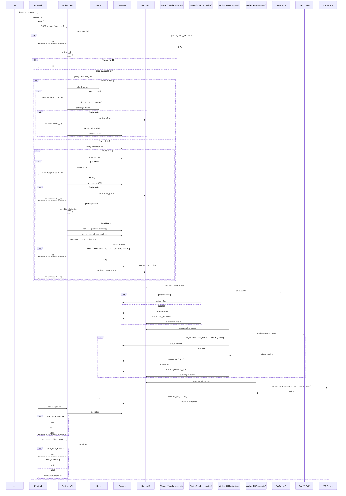

```mermaid
sequenceDiagram
    participant U as User
    participant FE as Frontend
    participant API as Backend API
    participant R as Redis
    participant DB as Postgres
    participant MQ as RabbitMQ
%%    participant WM as Worker (Metadata yt-dlp)
    participant WYM as Worker (Youtube metadata)
    participant WYS as Worker (YouTube subtitles)
    participant WL as Worker (LLM extraction)
%%    participant WA as Worker (Audio yt-dlp)
%%    participant WS as Worker (Speech)
    participant WP as Worker (PDF generator)
    participant YT as YouTube API
%%    participant M as MinIO
%%    participant STT as SpeechKit
    participant LLM as Qwen72B API
    participant PDF as PDF Service

%% ================= CREATE JOB =================
    U->>FE: Вставляет ссылку
    FE->>FE: validate URL
    FE->>API: POST /recipes {source_url}
    
    API->>R: check rate limit
    alt RATE_LIMIT_EXCEEDED
        API-->>FE: 429
    else OK
        API->>API: validate URL
        alt INVALID_URL
            API-->>FE: 400
        else build canonical_key

        %% ========= CACHE FIRST =========
            API->>R: get by canonical_key
            alt found in Redis

                API->>R: check pdf_url
                alt pdf_url exists
                    API-->>FE: GET /recipes/{job_id}/pdf
                else no pdf_url (TTL expired)
                    API->>R: get recipe JSON
                    alt recipe exists
                        API->>MQ: publish pdf_queue
                        API-->>FE: GET /recipes/{job_id}
                    else no recipe in cache
                        API->>DB: fallback check
                    end
                end

            else not in Redis

            %% ========= DB FALLBACK =========
                API->>DB: find by canonical_key
                alt found in DB

                    API->>DB: check pdf_url
                    alt pdf exists
                        API->>R: cache pdf_url
                        API-->>FE: GET /recipes/{job_id}/pdf
                    else no pdf

                        API->>DB: get recipe JSON
                        alt recipe exists
                            API->>MQ: publish pdf_queue
                            API-->>FE: GET /recipes/{job_id}
                        else no recipe at all
                            API->>API: proceed to full pipeline
                        end
                    end

                else not found in DB

                %% ========= FULL PIPELINE =========
                    API->>DB: create job (status = scanning)
                    API->>DB: save source_url, canonical_key
                    API->>R: save source_url, canonical_key
                    API->>WYM: check metadata
                    alt VIDEO_UNAVAILABLE / TOO_LONG / NO_AUDIO
                        API-->>FE: 400
                    else OK
                        WYM->>DB: status = transcribing
                        API->>MQ: publish youtube_queue
                    end

%%                    alt YouTube
%%                        API->>MQ: publish youtube_queue
%%                    else Other platform
%%                        API->>MQ: publish downloading_queue
%%                    end

                    API-->>FE: GET /recipes/{job_id}
                end
            end
        end
%% ================= SUBTITLES WORKER =================
    WYS->>MQ: consume youtube_queue

    WYS->>YT: get subtitles
    alt subtitles error
        WYS->>DB: status = failed
    else success
        WYS->>DB: save transcript
        WYS->>DB: status = llm_processing
        WYS->>MQ: publish llm_queue
    end

%% ================= LLM WORKER =================
    WL->>MQ: consume llm_queue

    WL->>LLM: send transcript (stream)
    alt AI_EXTRACTION_FAILED / INVALID_JSON
        WL->>DB: status = failed
    else success
        LLM-->>WL: stream recipe
        WL->>DB: save recipe (JSON)
        WL->>R: cache recipe
        WL->>DB: status = generating_pdf
        WL->>MQ: publish pdf_queue
    end

%% ================= OTHER PLATFORM'S TRANSCRIBING =================

%% ================= AUDIO DOWNLOADING =================
%%    WA->>MQ: consume downloading_queue
%%    WA->>DB: status = downloading
%%
%%    WA->>R: get source_url
%%    WA->>WA: download audio from URL
%%    alt EXTRACT_ERROR
%%        WA->>DB: status = failed
%%    else 
%%        WA->>M: putObject(audioKey)
%%        alt UPLOAD_ERROR
%%            WA->>DB: status = failed
%%        else
%%            API->>MQ: publish speech_queue
%%        end 
%%    end

%% ================= SPEECH WORKER =================
%%    WS->>MQ: consume speech_queue
%%    WS->>DB: status = transcribing
%%    WS->>M: getObject(audioKey)
%%    alt DOWNLOAD_ERROR
%%        WS->>DB: status = failed
%%    else    
%%        WS->>STT: send audio for transcribing
%%        alt transcription error
%%            WS->>DB: status = failed
%%        else success
%%            WS->>DB: save transcript
%%            WS->>M: removeObject(audioKey)
%%            WS->>DB: status = llm_processing
%%
%%            WS->>LLM: send transcript
%%            alt AI_EXTRACTION_FAILED / INVALID_JSON
%%                WS->>DB: status = failed
%%            else success
%%                WS->>DB: save recipe (JSON)
%%                WY->>R: cache recipe
%%                WS->>DB: status = generating_pdf
%%            end
%%        end
%%    end

%% ================= PDF =================
    WP->>MQ: consume pdf_queue
    WP->>PDF: generate PDF (recipe JSON + HTML template)
    PDF-->>WP: pdf_url
    WP->>R: save pdf_url (TTL 24h)
    WP->>DB: status = completed

%% ================= POLLING =================
    FE->>API: GET /recipes/{job_id}
    API->>DB: get status
    alt JOB_NOT_FOUND
        API-->>FE: 404
    else found
        API-->>FE: status
    end

%% ================= DOWNLOAD PDF =================
    FE->>API: GET /recipes/{job_id}/pdf
    API->>R: get pdf_url
    alt PDF_NOT_READY
        API-->>FE: 404
    else PDF_EXPIRED
        API-->>FE: 410
    else OK
        API-->>FE: 302 redirect to pdf_url 
    end
end    
```